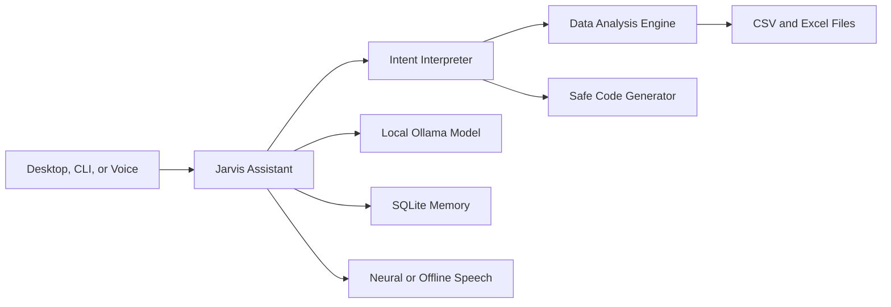

# J.A.R.V.I.S.

> A local-first AI command center for conversation, coding, app control, memory, and task agents.

Jarvis is a Windows-focused Python assistant designed to stay on your local device whenever possible. It combines natural conversation, persistent memory, microphone input, human-friendly speech, spreadsheet analysis, safe code generation, and an animated science-fiction interface.

The project is built around a simple principle: your assistant should answer questions, help you code, and automate work locally instead of sending everything to the cloud.

## Highlights

- **Local intelligence** — conversations run through an Ollama model on your computer.
- **Cinematic desktop UI** — animated reactor core, telemetry, quick actions, voice states, and Fast/Deep modes.
- **Natural voice output** — neural speech with an offline fallback and formatting-aware pronunciation.
- **Persistent memory** — remembers facts, successful answers, feedback, and custom phrases in SQLite.
- **CSV and Excel analysis** — summaries, grouped calculations, correlations, charts, and worksheet selection.
- **Read-only SQL** — query the active dataset locally without permitting database writes.
- **Code generation** — generate Python and SQL without automatically executing untrusted code.
- **Intent interpretation** — understands informal, incomplete, and misspelled requests.
- **Local learning** — teach Jarvis phrases and mark answers as helpful or incorrect.
- **Task agents** — organize work into goal-driven agent flows for repeatable tasks.
- **App control foundation** — ready for local desktop automation and app interaction skills.

## Interface

The Version 1 desktop experience includes:

- a hover-reactive animated intelligence core;
- one-click voice activation from the reactor;
- live signal and system telemetry;
- shortcuts for memory, analysis, coding, diagnostics, and briefings;
- a structured conversation console;
- optional spoken responses; and
- separate previews for generated charts.

## Architecture



## Requirements

- Windows 10 or Windows 11
- Python 3.11 or newer
- [Ollama](https://ollama.com/) running locally
- A microphone for voice input
- Internet access only for Google speech recognition and the optional neural voice

Typed chat, Ollama reasoning, memory, and dataset analysis remain local.

## Installation

Clone the repository and enter the project directory:

```powershell
git clone https://github.com/Karanvirsaib/Jarvis.git
cd Jarvis
```

Create a virtual environment and install the dependencies:

```powershell
python -m venv venv
.\venv\Scripts\Activate.ps1
python -m pip install --upgrade pip
python -m pip install -r requirements.txt
```

Install the default local model:

```powershell
ollama pull qwen3:8b
```

Ensure Ollama is running before starting Jarvis.

## Running Jarvis

### Desktop command center

```powershell
.\venv\Scripts\python.exe .\main.py --mode desktop
```

### Typed terminal chat

```powershell
.\venv\Scripts\python.exe .\main.py
```

### Typed chat with spoken answers

```powershell
.\venv\Scripts\python.exe .\main.py --speak
```

### Continuous voice mode

```powershell
.\venv\Scripts\python.exe .\main.py --mode voice
```

You can also run `launch_jarvis.py` to open the desktop interface using the project virtual environment.

## Example Commands

### Conversation and intelligence

```text
What can you do?
system status
morning briefing
deep mode
think deeply: explain how neural networks learn
```

### Memory and learning

```text
remember project is Jarvis
show memory
forget project
learn phrase: show me the cash => sum revenue by region
good answer
that's wrong
learning stats
```

### Data analysis

```text
analyze C:\path\to\sales.csv
analyze C:\path\to\workbook.xlsx
list sheets
use sheet Sales
data summary
describe column revenue
sum revenue by region
average revenue by product
bar chart revenue by region
correlations
```

### SQL and code generation

```text
sql SELECT region, SUM(revenue) FROM data GROUP BY region
write sql: calculate total revenue by region
write python: clean missing values in a CSV and save a new file
```

The loaded dataset is exposed to SQL as a table named `data`. Only `SELECT` and `WITH` queries are accepted, and displayed results are limited to 200 rows. Generated Python and SQL are shown to the user but never executed automatically.

## Natural-Language Data Requests

Jarvis uses a local intent interpreter to map informal requests to safe, deterministic tools. For example:

```text
show me da money by place
make a grapf of sales for each product
```

When the intended columns are clear, Jarvis performs the corresponding grouped calculation or chart. Low-confidence interpretations fall back to ordinary conversation instead of running a tool.

## Local Memory and Privacy

Jarvis stores personal facts, interaction feedback, and learned phrases in `data/jarvis.db`. This database is excluded from Git and should remain private to each installation.

Jarvis does not:

- upload its SQLite memory to this repository;
- rewrite its own source code;
- automatically execute generated code; or
- allow write operations through its dataset SQL interface.

Speech-to-text currently uses Google Speech Recognition. Neural speech uses Microsoft Edge TTS when available and falls back to offline Windows speech if the neural service cannot be reached.

## Configuration

Jarvis is configured with environment variables:

| Variable | Default | Purpose |
| --- | --- | --- |
| `JARVIS_MODEL` | `qwen3:8b` | Ollama model used for conversation |
| `JARVIS_DATABASE` | `data/jarvis.db` | Local SQLite memory location |
| `JARVIS_SPEECH_RATE` | `175` | Offline speech rate |
| `JARVIS_LISTEN_TIMEOUT` | `5` | Seconds to wait for microphone input |
| `JARVIS_PHRASE_TIME_LIMIT` | `15` | Maximum spoken-command duration |
| `JARVIS_OLLAMA_KEEP_ALIVE` | `30m` | Time Ollama keeps the model loaded |
| `JARVIS_MAX_RESPONSE_TOKENS` | `384` | Standard response-token budget |
| `JARVIS_NEURAL_VOICE` | `en-GB-RyanNeural` | Edge TTS voice |
| `JARVIS_NEURAL_VOICE_RATE` | `+0%` | Neural speech speed adjustment |
| `JARVIS_NEURAL_VOICE_PITCH` | `-2Hz` | Neural speech pitch adjustment |

Example:

```powershell
$env:JARVIS_MODEL = "qwen3:14b"
$env:JARVIS_MAX_RESPONSE_TOKENS = "512"
.\venv\Scripts\python.exe .\main.py --mode desktop
```

## Project Structure

```text
Jarvis/
├── core/                 Assistant routing, memory, LLM, analysis, and coding
├── ui/                   Cinematic CustomTkinter desktop interface
├── voice/                Speech recognition and natural speech output
├── data/                 Local runtime data, excluded from Git
├── main.py               CLI, voice, and desktop entry point
├── launch_jarvis.py      Windows desktop launcher
├── config.py             Environment-based configuration
└── test_*.py             Automated test suite
```

## Tests

Run the complete test suite:

```powershell
.\venv\Scripts\python.exe -m unittest discover -v
```

Version 1 currently includes tests for memory, intent interpretation, LLM options, safe code generation, dataset analysis, read-only SQL, assistant routing, and natural speech formatting.

## Capabilities and roadmap

Jarvis is intended to grow into a fully local, Codex-like assistant that can:

- answer questions and carry on natural conversation;
- write, explain, and refine code locally;
- understand your intent and turn it into safe actions;
- control supported desktop apps and workflows through tools;
- organize multi-step tasks into agent-style work plans; and
- keep conversation, memory, and task context on your device whenever possible.

The current Version 1 roadmap focuses on the pieces needed to make that experience practical:


- wake-word detection;
- email and calendar briefings;
- scheduled and continuous monitoring;
- deeper local-document research with citations;
- installable skill modules;
- configurable UI themes;
- streaming responses and speech;
- desktop app automation for common workflows;
- multi-step task agents that can plan, act, and report progress; and
- packaged Windows releases.

## Acknowledgements

The project takes architectural inspiration from [OpenJarvis](https://github.com/open-jarvis/OpenJarvis), particularly its local-first approach, agent modes, briefings, monitoring, and extensible skills philosophy.

Jarvis and the cinematic interface are an independent fan-inspired project and are not affiliated with Marvel Studios or Stark Industries.

---

Built as a personal, local-first AI command center.
